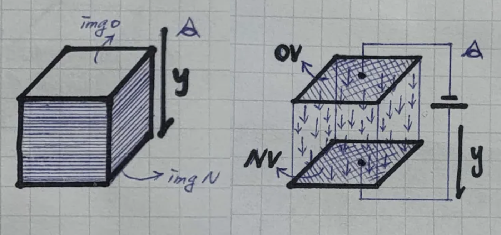
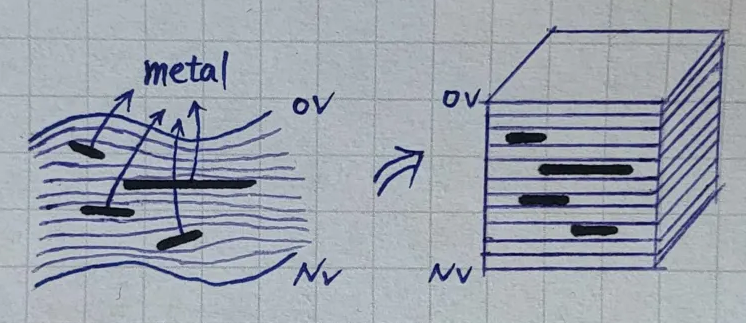
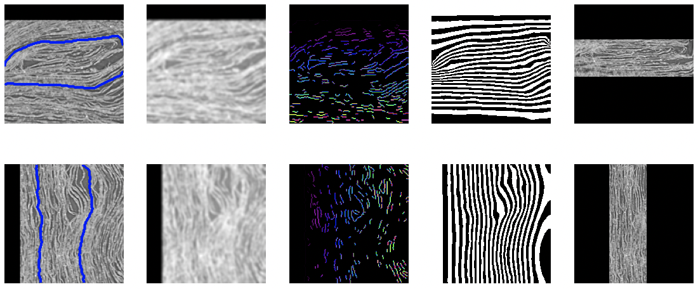

# Field-Based Visualization

This document introduces a field-based visualization approach for exploring 3D datasets. The goal is to present the core concepts, showcase initial attempts, and identify the challenges this method could help solve.

Rather than focusing on implementation details, I aim to emphasize the foundational ideas. To make the concepts more accessible, I will include a series of hand-drawn illustrations that provide clear explanations for anyone interested in developing their own implementations or optimizations.

---

## Concept

Imagine you have a 3D grid dataset. How would you visualize it? The most straightforward method might involve slicing through the data along the x, y, or z axes, as shown below:  

  

Now, let's reframe this exploration method. Imagine placing two parallel plates at the ends of the grid that generate an electric field. This field creates potential gradient lines across the grid, as illustrated here:  

  

In this perspective, users navigate the data by following the equipotential lines generated by the electric field.  

---

## Advantages of Field-Based Navigation

This approach allows for a new way of thinking about data exploration. By redefining the shape of the electrodes, you can control how the data is visualized. For example:  

### Flat Electrode Configuration  
  

### Ring Electrode Configuration  
  

The benefits of this visualization method include:  
1. **Customizable Navigation:** The user can define electrode shapes to align with specific surfaces of interest.  
2. **Continuous Exploration:** There's no need to explicitly define every surface detail between the electrodes, offering a smooth browsing experience.  

---

## Adaptive Potential via Internal Features

Often, datasets contain features such as surfaces, edges, fibers, or segments that are of particular interest. These features can be treated as conductive layers (metal plates), ensuring that the electric potential across these surfaces is nearly constant.  

By aligning the internal potential field with these features, users can intuitively navigate the dataset along the normal directions of these surfaces. For example:  

  

This method allows data exploration aligned with its inherent structures, offering insights that may be less apparent with traditional slicing methods.

## Result  

Below are the initial results of my experiment:  

  

- **First Row:** Original data slices along the z and y axes, with electrodes shown as blue curves.  
- **Second Row:** The result of applying a blur to the data.  
- **Third Row:** Edges extracted from the blurred data, represented as a colored map. These edges act as "metal plates," the internal features used to adjust the electric potential, as described earlier.  
- **Fourth Row:** Black-and-white stripe patterns showing the electric potential after iterative updates.  
- **Fifth Row:** Equipotential lines extracted from the potential field, forming the final flattened surface representation.  

Here is a video showcasing the final results. When navigating along the y-axis, the data is explored primarily in the normal direction of the surface, revealing extensive information about the papyrus fiber structures. Currently, only basic edge detection is used to adjust the potential field. Incorporating more precise feature data, such as fibers or segments, would further enhance the visualization.  

## Further Studies

This visualization method opens up several new possibilities:  

- **Surface Flattening for Extended Analysis:**  
  By enabling large-scale surface flattening, this approach extends the concept of subvolumes. It allows 2D models to make inferences directly over broader regions of a 3D space. *(Illustrations to be added.)*  

- **Ring Electrode Configuration for Scroll Exploration:**  
  With sufficient memory and computational resources, the method could treat the outermost edge and the central "core" of a scroll as the two ends of a ring electrode. This configuration enables the computation of internal potential gradients, making it possible to "page through" the scroll from its outermost layers inward. *(Illustrations to be added.)*  

- **Dynamic Updates for Interactive Visualization:**  
  The ability to dynamically update the potential field makes interactive visualizations feasible. Boundaries could be automatically generated, or specific regions manually adjusted, allowing users to tailor the visualization to current needs. *(Illustrations to be added.)*  

- **Mapping Original and Flattened Points:**  
  After flattening the data, users may wish to trace specific points back to their original positions. Perhaps potential solution could involve visualizing intermediate states using linear superposition of potentials. *(Illustrations to be added.)*  

